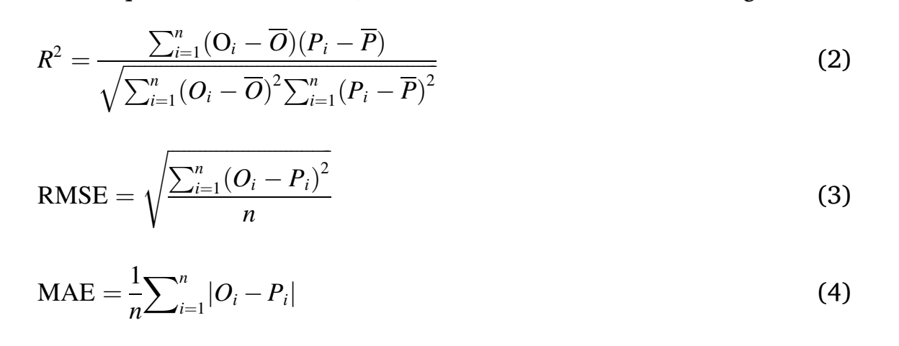

#随机森林的评价公式

公式解析
### R²（R-squared）：表示模型解释变量对因变量变异的解释程度。R²的值介于0和1之间，越接近1，说明模型对数据的拟合程度越好，即模型解释变量对因变量的变异解释得越好
### RMSE（Root Mean Square Error，均方根误差）：表示预测值与真实值之间的差异程度。RMSE的值越小，说明模型的预测精度越高
### MAE（Mean Absolute Error，平均绝对误差）：也是衡量预测精度的一个指标。MAE的值越小，说明模型的预测误差越小